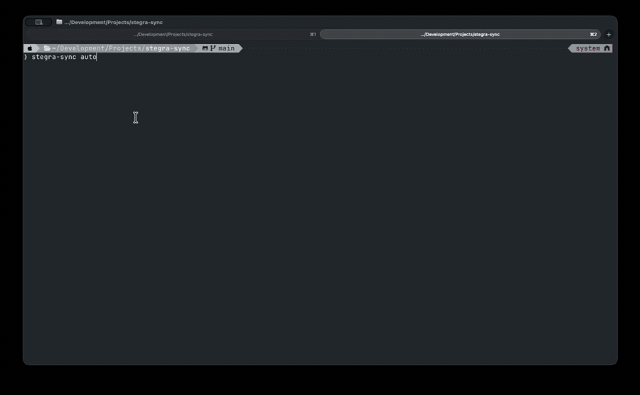

# stegra-sync

One-way sync from **Stegra.io** Collections/Routes into a **folder**.
Stegra is the source of truth; the target folder mirrors your library with
human-readable subdirectories, GPX files, and markdown sidecars.

The target can be anywhere your filesystem can reach — a regular folder
under `~/Documents`, a Google Drive folder (e.g.
`~/Google Drive/My Drive/Rides/`), iCloud Drive, Dropbox, an external
volume, or a network mount. Sync runs against whatever path you point it
at; cloud sync clients pick up the changes from there.



## Features

- **Stegra is the source of truth.** One-way only — routes flow from Stegra
  into the target. Nothing is ever sent back.
- **Collections map to subdirectories.** Each Stegra Collection becomes a
  subfolder; each route is a `.gpx` file with a sidecar `.md` carrying
  distance, duration, unpaved %, dates, and a clickable link back to the
  route in Stegra Studio.
- **Any folder works.** Local, Google Drive, iCloud Drive, Dropbox, an
  external volume, a network mount — the tool only writes plain files;
  cloud sync clients handle the rest.
- **Incremental.** Only routes whose `modified_at` changed get re-written;
  everything else is skipped via a cursor. Re-running on a clean state is
  a fast no-op.
- **Handles deletes, moves, and multi-collection membership.** Routes
  removed from Stegra get cleaned up. Routes that move between collections
  move locally. Routes in multiple collections are duplicated into each
  subfolder.
- **Safe by default.** `plan` shows a structured dry-run preview before any
  write; `apply --execute` runs the writes with a single y/N prompt only
  when something is about to be deleted.
- **Resumable after failure.** The manifest at
  `<target>/.stegra-sync-state.json` is persisted after every successful
  action, so a partial failure can be picked up on the next run.
- **Hands-off on existing files.** Only manifest-tracked files are ever
  modified or deleted; any other content you put in the target folder is
  left alone.
- **One-command flow.** `stegra-sync auto` chains token refresh → snapshot
  pull → diff → apply → tree report. First run prompts for setup; later
  runs read the saved config.
- **Filename collision resolution.** Route names with forbidden characters
  are sanitised; duplicates within one folder get ` (2)`, ` (3)` suffixes.

## Status

Working end-to-end. The full flow (`auto`) is verified against a real
Stegra account (19 routes across 5 collections). Day-to-day use is a
single command after the initial setup.

## Install

Requires Python 3.11+. Pick one (Homebrew Python blocks bare `pip install`
under PEP 668; this is normal).

**A. pipx (recommended for a CLI).** Isolated venv, `stegra-sync` on your
PATH globally:

```bash
brew install pipx        # one-time, if not already installed
pipx ensurepath          # one-time
pipx install -e .
```

**B. Plain venv.** No new tools, but you must activate the venv to use the CLI:

```bash
python3 -m venv .venv
source .venv/bin/activate
pip install -e .
```

Upgrade after code changes: `pipx install -e . --force` (option A) or just
re-run the CLI — `-e` is editable so changes take effect immediately (option B).

## Quick start

```bash
stegra-sync auto
```

The first run prompts for a target folder (e.g.
`~/Google Drive/My Drive/Rides/`) and a couple of preferences, then saves
the answers to `~/.config/stegra-sync/config.json`. Every subsequent run
just reads the config and chains auth-refresh → pull → plan → apply in one
shot. Destructive actions still get a single y/N confirmation; everything
else just goes.

Use `stegra-sync auto --reset` to redo the first-time setup.

## Usage (individual commands)

`auto` is the recommended path. The lower-level commands below are useful
for scripting, debugging, or dry-running before committing.

### `auth` — capture your Stegra access token

```bash
# Default: paste the token once. The command prints a DevTools console
# snippet that copies the token to your clipboard.
stegra-sync auth

# Zero-paste: extract the token from a live Chrome tab via AppleScript.
# Requires the Chrome setting described in the Auth notes — recommended
# to turn it on only for the sync run and back off afterwards.
stegra-sync auth --apple-events
```

Tokens are short-lived (~60 minutes). Re-run when Stegra calls start
returning 401. Credentials are stored at `~/.config/stegra-sync/auth.json`
(mode 0600).

### `pull` — fetch a Stegra snapshot + GPX cache

```bash
# Incremental: only fetches changes since the cached cursor.
stegra-sync pull

# Force a full re-pull (cursor=0). GPX cache still respected — files only
# re-download when their modified_at actually changed.
stegra-sync pull --full

# Override the workdir (default ./sync-data):
stegra-sync pull -w ~/stegra-snapshots
```

Writes:

- `<workdir>/snapshots/stegra.json` — full merged state with a `cursor`.
- `<workdir>/snapshots/stegra.cursor` — last `max_seq` for shell scripting.
- `<workdir>/gpx/<route-uuid>.gpx` — per-route GPX cache.

### `inspect` — show the target folder's current state

```bash
stegra-sync inspect -t ~/Google\ Drive/My\ Drive/Rides/
```

Reads the manifest at `<target>/.stegra-sync-state.json` and prints a
folder/entry summary.

### `plan` — diff Stegra vs the target folder

```bash
stegra-sync plan -t ~/Google\ Drive/My\ Drive/Rides/
stegra-sync plan -t ~/Google\ Drive/My\ Drive/Rides/ -v   # show reasons
```

Writes a timestamped JSON plan to `<workdir>/plans/plan-*.json` and prints
a grouped action table.

### `apply` — execute the plan

```bash
# Dry-run preview (default — no writes):
stegra-sync apply -t ~/Google\ Drive/My\ Drive/Rides/

# Actually apply:
stegra-sync apply -t ~/Google\ Drive/My\ Drive/Rides/ --execute
```

Order: create_folder → rename_folder → upload_gpx → delete_gpx → delete_folder.
Manifest is persisted after each successful action so a partial failure can
be resumed by re-running `plan` then `apply` again.

## Layout on disk

```
~/Google Drive/My Drive/Rides/
├── .stegra-sync-state.json     # manifest (route+collection → file)
├── Bunyip/
│   ├── Bunyip Ridge Track Loop - Hard.gpx
│   └── Bunyip Ridge Track Loop - Hard.md
├── GSR/
│   ├── GSR1-Day1A (182kms).gpx
│   ├── GSR1-Day1A (182kms).md
│   └── ...
├── Pyrenees/
│   └── ...
├── Vic High Country/
│   └── ...
└── Unsorted/                   # routes with no Stegra collection
    └── ...
```

Each `.md` sidecar carries the route's stats, dates, color, and description:

```markdown
# D1 Pyreness Untamed ADV-V2

**Collection:** Pyrenees

| Stat | Value |
|---|---|
| Distance | 257.0 km |
| Duration | 4h 51m |
| Unpaved | 175.7 km (68%) |
| Color | #E834EC |
| Created | 2026-05-10 11:11 UTC |
| Modified | 2026-05-10 11:11 UTC |

## Description

Mixed Gravel roads, forestry trails and 4x4 tracks - Grade Level 2+

---
<sub>route_id: `865a762f-…` · collection_id: `f9e595c8-…` · synced: 2026-06-03T…</sub>
```

## Identity model

A composite key `(stegra_route_id, stegra_collection_id)` identifies each
synced entry. Routes in multiple Stegra Collections are duplicated into the
corresponding subfolders. Filename collisions inside a folder are resolved
by appending ` (2)`, ` (3)`.

The manifest at `<target>/.stegra-sync-state.json` stores the identity of
every managed file plus its Stegra `modified_at`, so the next `plan` knows
exactly what changed and what to leave alone. Files in the target that the
manifest doesn't claim are treated as unmanaged and never modified.

## Auth notes

Only the Stegra access token is captured by `auth`. It's an Azure AD B2C
bearer with a ~60 minute lifetime.

### Using `--apple-events`

The AppleScript path reads the Stegra token straight from a running
`stegra.io` tab in Chrome — no copy/paste. It requires a Chrome setting
that's worth treating as a temporary capability rather than something to
leave on:

`Chrome menu bar → View → Developer → Allow JavaScript from Apple Events`

When this is on, **any application on your Mac with Automation permission
for Chrome can run arbitrary JavaScript in any of your open tabs** —
including pages where you're signed in to banking, email, or other
sensitive accounts. macOS will also prompt for Automation permission the
first time `stegra-sync` (or your terminal) talks to Chrome.

Recommended pattern:

1. Toggle the menu item **on** just before you run `stegra-sync auto`.
2. Run the sync.
3. Toggle it **off** again.

If you'd rather avoid the toggle each time, leave `--apple-events` off
and use the default flow: `stegra-sync auth` prints a one-line DevTools
snippet that copies the token to your clipboard, which you then paste.
A few extra seconds, no system-wide capability change.
